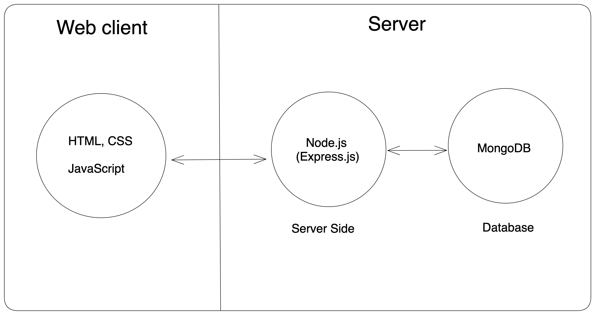

### Fullstack
#### 1.System Design
ระบบย่อ url
หลักการทำงาน 
input(url) -> compute -> output(short url)

Demo: https://shortermy.onrender.com/

รายละเอียดเทคโนโลยีที่ใช้ พร้อมเหตุผลที่เลือกใช้
- database
=> MongoDB เพราะต้องการร่วมทีมกับมายออเดอร์ จึงเลือกศึกษาฐานข้อมูลตามลักษณะงาน

- back-end
=> Node.js เพราะมีความคุ้นเคยกับภาษา JavaScript ทำให้ประหยัดเวลาในการทำงานนี้ให้สำเร็จ

- front-end
=> HTML, CSS, JavaScript เน้นความเข้าใจได้ง่าย เพราะเว็บทำหน้าที่ไม่มาก และไม่ได้มี component ที่ซับซ้อน

- deployment 
=> Deploy nodejs to https://render.com/ เพราะไม่มีค่าใช้จ่ายสำหรับแพ็กเกจเริ่มต้นของบริการ Web Services
และ AWS, Singapore สำหรับ database เพราะอยู่ใกล้ประเทศไทย ทำให้โหลดเร็วกว่าที่ที่อยู่ไกล และฟรี